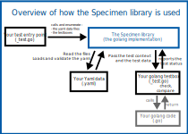

# Specimen

_Yaml-based data-driven testing_

Specimen is a data-driven testing library as well as a yaml data format. It enforces separation between the _feature being tested_ and the _data_ used for testing.

It comes with a **Golang**, a **Python** and a **JS** implementation for loading the data, checking its format, running your _test boxes_ (called _code boxed_) and comparing the result with the expected one.

It supports using the `FOCUS` and `PENDING` flag in the data tree to run only part of the test data.

## Overview



- A **Codebox** is a user-defined named function passed to `specimen.run`. It serves as an adaptator between Specimen and the user code being tested. It also runs the verification steps after the code being tested has finished.
- A **Slab** is a chunk of data to be loaded into a codebox. They are the leaves of the yaml files data tree that Specimen processes.

## Getting started with the Golang implementation

To get started, create a directory `it/` and the three files `it.go` `it_test.go` and `it_testdata.yaml`. For each file, copy the content of linked section. Finally, run `go test` in the `it/` directory.

```sh
mkdir it
cd it
touch it.go it_test.go it_testdata.yaml
```

- `it.go` see [Example package code](#example-package-code)
- `it_test.go` see [Code box](#code-box)
- `it_testdata.yml` see [Yaml Data](#yaml-data)

Finally:

```sh
go mod init it
go mod tidy
go test
```

You should get an output like this one:

```
TestIt:
2 slab-s succeeded over 2. (0 failed)
PASS
ok      it
```

## Yaml Data

The yaml data file looks like this:

```yaml
content:
  - box: turn_page
    content:
      - flag: FOCUS
        input:
          book:
            title: aleph
            left_page: 0
            size: 90
          turn_page_count: 4
          expected_result:
            title: aleph
            left_page: 8
            size: 90
      - flag: PENDING
        input:
          book:
            title: aleph
            left_page: 0
            size: 90
          turn_page_count: 4
          expected_left_page: 8
  - flag: FOCUS
    box: get_page
    input:
      book:
        title: aleph
        left_page: 44
        size: 90
      expected_result: 44
```

The input entry is required and must be a map. It is passed to the test box. The output entry may be any value but it must only be present if the box returns a value. The supported flags are FOCUS and PENDING - the uppercase is mandatory. These two flags are supported on all nodes of the data tree.

## Code box

A code box is an **adapter** between the parsed data and the library code being tested. It takes as input the testing context `s` and the **input map**. A code box looks like this:

```go
package it_test

import (
    "it"
    "testing"

    "github.com/ditrit/specimen/go/specimen"
)

var codeboxSet = specimen.MakeCodeboxSet(map[string]specimen.BoxFunction{
    "turn_page": func(s *specimen.S, input specimen.Dict) {
        book_data := input["book"].(map[string]interface{})
        book := it.Book{
            Title:    book_data["title"].(string),
            LeftPage: book_data["left_page"].(int),
            Size:     book_data["size"].(int),
        }
        book.TurnPage(input["turn_page_count"].(int))

        s.ExpectEqual(
            specimen.Dict{
                "title":     book.Title,
                "left_page": book.LeftPage,
                "size":      book.Size,
            },
            input["expected_result"].(specimen.Dict),
            "result comparison",
        )
    },
    "get_page": func(s *specimen.S, input specimen.Dict) {
        book_data := input["book"].(map[string]interface{})
        book := it.Book{
            Title:    book_data["title"].(string),
            LeftPage: book_data["left_page"].(int),
            Size:     book_data["size"].(int),
        }
        s.ExpectEqual(
            book.GetPage(),
            input["expected_result"].(int),
            "result comparison",
        )
    },
})

func TestIt(t *testing.T) {
    specimen.Run(
        t,
        codeboxSet,
        []specimen.File{
            specimen.ReadLocalFile("it_testdata.yaml"),
        },
    )
}
```

## Example package code

```go
package it

type Book struct {
    Title    string
    LeftPage int
    Size     int
}

func (b *Book) TurnPage(count int) {
    b.LeftPage += 2 * count

    if b.LeftPage < 0 {
        b.LeftPage = 0
    } else if b.LeftPage >= b.Size {
        b.LeftPage = b.Size - 1
    }
}

func (b *Book) GetPage() int {
    return b.LeftPage
}
```

## Running the examples

```sh
# golang
go test ./test/counter ./test/danger ./test/novel ./test/zoo
# or
go test test/counter/counter_test.go
go test test/danger/danger_test.go
go test test/novel/novel_test.go
go test test/novel/nullValue_test.go
go test test/zoo/zoo_test.go

# python
python test/counter/counter_test.py
python test/novel/novel_test.py
python test/novel/nullValue_test.py
python test/zoo/zoo_test.py

# js
cd js
yarn install
# yarn parcel build src/index.ts
yarn tsc
cd ..
node test/counter/counter_test.js
node test/novel/novel_test.js
node test/novel/nullValue_test.js
node test/zoo/zoo_test.js
```

## Yaml Schema

The content of a yaml test data file must match the `main` rule of the lidy schema below:

```yaml
main: nodule

# scalar is any yaml scalar
scalar:
  _oneOf:
    - string
    - int
    - float
    - boolean
    - nullType

# A termination can be a scalar or a list of scalars. In the case of a list,
# the current branch will be demultiplied in subbranches. If you have two of
# these subbranches or more, they produce the effect of a test matrixes or
# test tensor.
termination:
  _oneOf:
    - scalar
    - _listOf: scalar

nodule:
  _mapFacultative:
    # content contains all the children of the current nodule. Nodes which
    # contain a content entry are seen as tree nodes, while nodes which do
    # not contain it are seen as leaves
    content:
      - _listOf: nodule
    # The PENDING flag tells the engine to skip the node and all its decendants.
    # The FOCUS flag tells the engine to skip all the OTHER nodes that do not
    # have the flag "FOCUS"
    flag:
      _in: ["PENDING", "FOCUS"]
  # all the entries of the mapping will be added to the descendant slabs of
  # this nodule and then passed to the code box, except for the `content` entry
  _mapOf: { string: termination }
# Besides all the keys that are found in the yaml, the code box will be passed
# an argument "title": an array of strings, the titles the library encountered
# on its way to the tree leaf. The code box will also be passed an argument
# "filename" which contains the name of the file, as specified to the library.
```
